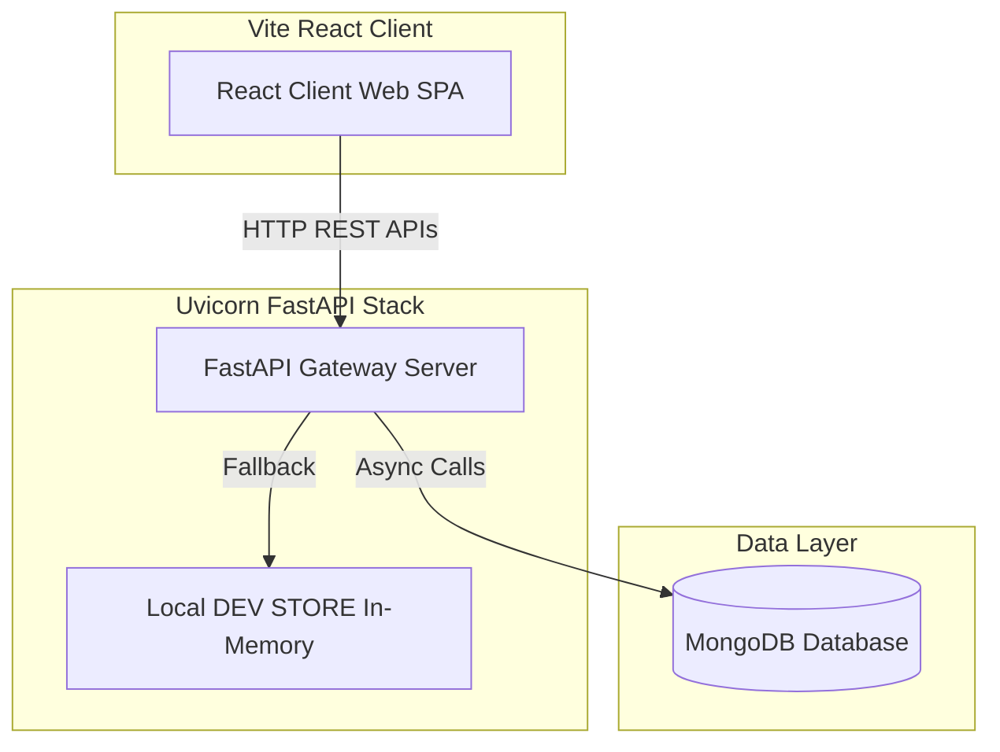

# 🏫 MIT Connect — Campus Management System

MIT Connect is a state-of-the-art, role-based college portal designed for **Movicloud Institute of Technology**. Built with a modern, high-performance tech stack, it provides centralized administration, faculty coordination, student dashboards, and financial operations.

---

## 🛠️ Tech Stack & Badges

[](https://reactjs.org/)
[](https://vitejs.dev/)
[](https://tailwindcss.com/)
[](https://fastapi.tiangolo.com/)
[](https://www.python.org/)
[](https://www.mongodb.com/atlas)
[](https://opensource.org/licenses/MIT)

---

## 🚀 Key Features

- 🔐 **Multi-Role Authentication**: Access levels customized for **Students**, **Faculty**, **Finance Officers**, and **Admins**.
- 📊 **Dynamic Dashboard KPI Cards**: Live totals of students, faculty, courses, and pending requests computed directly from the MongoDB database.
- 📅 **Dynamic Attendance System**: 
  - Faculty can select a Class, Date, and Hour (1-8) to mark student attendance.
  - Integration with **On-Duty (OD)** request approvals: Approved OD hours automatically credit students as "Present" in dynamic calculations.
  - Automatic updates of student attendance percentages and thresholds (with visual warnings for attendance $< 75\%$).
- 💳 **Invoice & Fee Assignment Pipeline**:
  - Admins can assign structured college fees to students.
  - Generation of standard student invoices.
  - Secure simulated payment flow updates status across panels in real-time.
- ⚡ **Real-time Event Synchronization**: Responsive component updates using lightweight CustomEvent emitters.

---

## 🔑 Demo Access Credentials

| Role | User ID | Password | Access Details |
| :--- | :--- | :--- | :--- |
| **Student** | `STU-2024-1547` | `student123` | View personal attendance, class schedule, paid/due invoices, and submit OD requests. |
| **Faculty** | `FAC-204` | `faculty123` | View teaching schedules, manage classes, mark hourly attendance, and review student OD requests. |
| **Finance** | `FIN-880` | `finance123` | Review fee accounts, disburse payrolls, track total revenue, and manage financial settings. |
| **Admin** | `ADM-0001` | `admin123` | Manage departments, modify student/faculty databases, allocate system configurations. |

---

## 🏗️ System Architecture

MIT Connect employs a decoupled Client-Server architecture. The React SPA communicates with the asynchronous FastAPI gateway via JSON REST APIs.



---

## 📁 Repository Directory Structure

```text
cms-main/
├── backend/                    # Python Backend API (FastAPI)
│   ├── db.py                   # MongoDB Database configuration & Lifespan
│   ├── dev_store.py            # Local in-memory offline fallback database
│   ├── index.py                # Server execution entrypoint
│   ├── main.py                 # FastAPI Application router registration
│   ├── models/                 # MongoDB data models
│   ├── routes/                 # Endpoint routers (Academics, Students, Finance, etc.)
│   ├── schemas/                # Pydantic Schemas for validation
│   ├── stores/                 # Legacy Express DB stores (Python compatible)
│   └── utils/                  # Utility helpers (Attendance formulas, notification engines)
├── frontend/                   # Frontend SPA Client (Vite + React)
│   ├── index.html              # Entry HTML template
│   ├── src/                    # React source files
│   │   ├── api/                # API Client integrations (settingsApi, attendanceApi)
│   │   ├── components/         # Reusable layouts, grids, KPI cards
│   │   ├── context/            # Shared React contexts (Admissions, Theme)
│   │   ├── pages/              # Main Route Pages (Attendance, Timetable, Dashboard)
│   │   └── styles.css          # Main styling rules
│   └── tailwind.config.cjs     # Tailwind CSS structural settings
├── render.yaml                 # Cloud deployment descriptor
├── start.bat                   # Zero-config startup launcher script
└── README.md                   # Project Documentation
```

---

## ⚙️ Local Setup Guide

### Prerequisites
- [Python 3.10+](https://www.python.org/downloads/)
- [Node.js 18+](https://nodejs.org/)
- [MongoDB Community Server](https://www.mongodb.com/try/download/community) (Or MongoDB Atlas Cluster connection URI)

---

### Step-by-Step Installation

#### 1. Setup Backend
Open a terminal and navigate to the project directory:

```bash
cd backend
```

Create a Python virtual environment and activate it:
```bash
# Windows
python -m venv .venv
.venv\Scripts\activate

# macOS/Linux
python3 -m venv .venv
source .venv/bin/activate
```

Install the dependencies:
```bash
pip install -r requirements.txt
```

Create a `.env` file in the `backend` folder (or copy from `.env.example`) and provide your MongoDB connection string:
```env
MONGODB_URI=mongodb+srv://<username>:<password>@cluster0.example.mongodb.net/CMS?retryWrites=true&w=majority
PORT=5000
```
*(If `MONGODB_URI` is not provided, the backend automatically falls back to dry-run offline `DEV_STORE` memory mode).*

Seed the database with default students, faculty members, and departments:
```bash
npm run seed
```

Start the FastAPI application:
```bash
python index.py
```
The API documentation will be available at: `http://localhost:5000/docs`

---

#### 2. Setup Frontend
Open a new terminal window and navigate to the `frontend` folder:

```bash
cd frontend
```

Install npm packages:
```bash
npm install
```

Start the Vite development server:
```bash
npm run dev
```
Open your browser and navigate to the printed address (usually `http://localhost:5173`).

---

## 🔌 Core API Endpoints

### 👤 Student Operations
- `GET /api/students` — Retrieve all registered student records.
- `GET /api/students/{id}` — Fetch detailed student card by ID.
- `POST /api/students` — Register a new student profile.
- `PUT /api/students/{id}` — Modify an existing student profile.

### 📅 Attendance & OD Pipeline
- `GET /api/academics/attendance` — Fetch individual/collective attendance stats.
- `GET /api/academics/attendance/markings` — Load date/hour class markings list.
- `PUT /api/academics/attendance/markings` — Save a marked attendance sheet (Faculty).
- `GET /api/academics/attendance/od-requests` — Retrieve pending/past On-Duty requests.
- `POST /api/academics/attendance/od-requests` — Submit a student OD request with reason and proof image.
- `PATCH /api/academics/attendance/od-requests/{id}/status` — Approve/Reject an OD request (Faculty).

### 🏛️ Department Operations
- `GET /api/settings/departments` — List departments with dynamically calculated student/faculty counts.
- `POST /api/settings/departments` — Create a new academic department.
- `PUT /api/settings/departments/{id}` — Edit department info or assign HODs.

---

## 📄 License
This project is licensed under the MIT License - see the [LICENSE](LICENSE) file for details.
